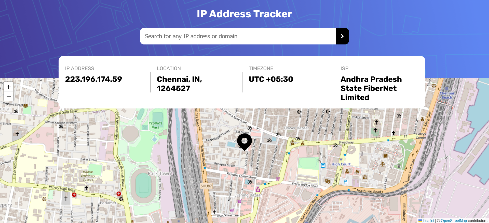

# IP address tracker

* Users see their own IP address on the map on the initial page load.

* Users can search for any IP addresses or domains and see the key information and location.

## Screenshot

 
## Links

- Solution URL: [code base](https://github.com/shanmukh-sai2003/ip-address-tracker)
- Live Site URL: [ip-address-tracker](https://shanmukh-sai2003.github.io/ip-address-tracker)

## Built with

- Semantic HTML5 markup
- CSS custom properties
- Flexbox
- [React](https://reactjs.org/) - JS library
- react-leaflet - library to use leaflet in react
- leaflet - libary to use maps interface

